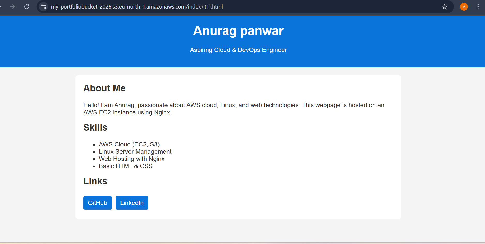
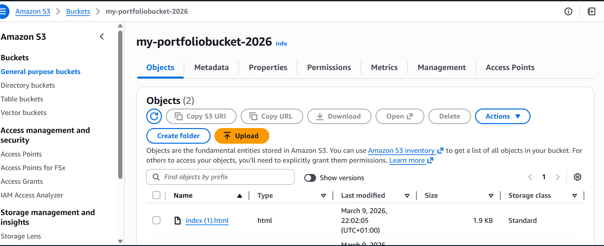
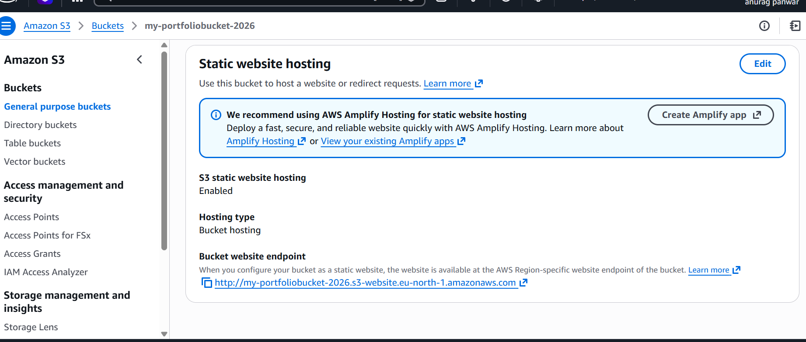

# Project 2 — Static Website Hosting using S3 with IAM Security

## 🚀 Overview
This project demonstrates hosting a static website using AWS S3 with proper access control using IAM.

## 🌐 Live Demo

https://my-portfoliobucket-2026.s3.eu-north-1.amazonaws.com/index+(1).html 

## 🧱 Architecture
User → Amazon S3 (Static Website Hosting)

## 🛠️ Technologies Used
- AWS S3
- AWS IAM

## ⚙️ Implementation Steps
1. Created an S3 bucket
2. Enabled static website hosting
3. Uploaded HTML, CSS files
4. Configured bucket policy for public access
5. Created IAM user with restricted permissions

## ✨ Features
- Highly available static hosting
- Secure access management
- Scalable storage

## 📌 Learning Outcomes
- Object storage concepts
- IAM users and policies
- Securing cloud resources
